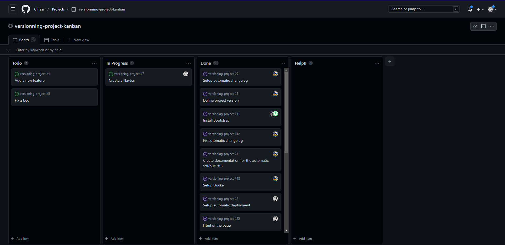
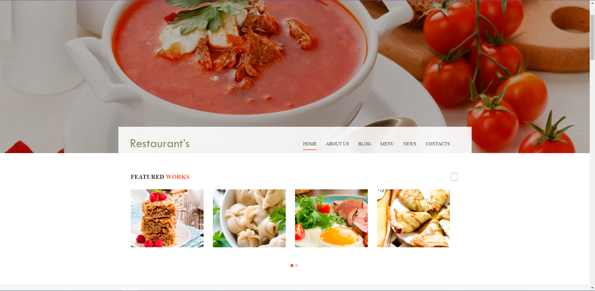

# versioning-project
## Collaborateurs
@Cihaan
@Gyomzz
@Pehlow
@PChl0e

## Workflow
Nous nous sommes inspirés du Feature-Branch-Workflow pour notre projet.
Celui-ci consiste à avoir une branche par fonctionnalité, fix, ou modification. Toutes les nouvelles modifications, se voit directement merge dans la branche develop, où elle est relue et testée par un pair avant d'être merge dans la branche master si celle-ci est valide. Dans le cas contraire, des commentaires sont ajoutés au Pull Request et le développeur à l'issue de la demande se doit de faire des modification avant une nouvelle vérification. Une fois le test passé, la branche se voit merge avec la branche master, qui sert de référence pour la mise en production du projet.

Voici une visualisation de ce workflow :  


## Commit
Pour la nomenclature des commits, nous sommes partis sur la Conventionnal Commit.

Celui-ci s'organise de la manière suivante:


## Pull request 
Pour la fusion des branches de feature, nous sommes passés par des Pull Requests. Les pull requests permettent de valider le code et la fonctionnalité avant de la fusionner avec le code dans le serveur de dev ou bien celui de développement. Durant la pull request, le pair se doit de confirmer la propreté du code et de son bon fonctionnement, si ce n'est pas le cas, il se doit faire des commentaires indiquant ce qui ne va pas et ce qu'il faut changer. Après quoi le code est relu une deuxième fois puis finalement validé puis merge vers la branche develop.

## Issue 
Pour se répartir les tâches, nous avons fait une list d'issues que nous nous sommes assignés et avons changé le label pour marquer son indisponibilité. Des labels ont été mis en place pour indiquer dans quelle case se place la feature : 
- feat
- breaking change
- chore
- deploy
- docs
- duplicate
- fix
- help wanted
- refactor 
Pour avoir une meilleure visualisations qu'une liste nous avons utilisé un Kanban.

## Kanban
Pour avoir une meilleur visualisation des tâches et de la répartition de celles-ci, nous avons utilisé un Kanban directement intégré à GitHub. Il permet une meilleur gestion du projet et permet de savoir où en sont les membres de l'équipe avec un coup d'oeil seulement. 

 

## Preview

 

## Live preview 

https://rainbow-biscotti-941430.netlify.app/ 

## Sources
Workflow : https://www.atlassian.com/git/tutorials/comparing-workflows/feature-branch-workflow  
Commit : https://www.conventionalcommits.org/en/v1.0.0/
Automated changelog: https://docs.github.com/en/repositories/releasing-projects-on-github/automatically-generated-release-notes#configuring-automatically-generated-release-notes

## Docker compose

To use docker compose simply run ```docker compose up -d```

You can see the project [here](http://localhost:8080/)

If u want to acces to the container run ```docker compose exec -it server bash``` 

## Test 
Run the test with : ``` npm test ```
